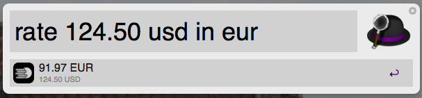

alfred-currencies
=================

Currency exchange rates workflow for [Alfred 2](http://www.alfredapp.com/).

## How to install

Download the `Exchange Rates.alfredworkflow` file and import it into Alfred.
Currency rates are fetched from [openexchangerates.org](http://openexchangerates.org). You need to register on their website and get free `app_id`. 
Open the workflow directory, rename `settings.py.template` file to `settings.py` and put your `app_id` in the `oer_app_id` variable.

## Usage

Use command in Alfred in the format: `rate VALUE_FROM CURRENCY_FROM in CURRENCY_TO`, for example: `rate 120 USD in EUR`. Commands are case insensitive and `in` can be, in fact, anything.

## Copyrights

This project uses [alfred-python by nikiopre](https://github.com/nikipore/alfred-python).

["Money" icon](http://thenounproject.com/term/money/20215/) designed by Patrick Morrison from the Noun Project is licensed under [Creative Commons – Attribution (CC BY 3.0)](http://creativecommons.org/licenses/by/3.0/).